<!-- README.md is generated from README.Rmd. Please edit that file -->

# ggchangepoint

<!-- badges: start -->

[](https://github.com/PursuitOfDataScience/ggchangepoint/actions/workflows/R-CMD-check.yaml)
[](https://CRAN.R-project.org/package=ggchangepoint)
[](https://lifecycle.r-lib.org/articles/stages.html#stable)
<!-- badges: end -->

ggchangepoint provides a unified tidy interface to changepoint analysis
in R. One dispatcher — `cpt_detect()` — covers **31 detection methods
across five methodological families**, every result comes back as the
same tidy `ggcpt` S3 object with `broom`-style methods (`tidy()`,
`glance()`, `augment()`), and every result renders directly with
`ggplot2` via `autoplot()` and a family of composable geoms.

The five families (run `cpt_methods()` for the live table):

- **Penalised / optimal partitioning** — PELT, BinSeg, SegNeigh, AMOC
  (`changepoint`), FPOP (`fpop`), the CROPS penalty path
  (`cpt_crops()`), fastcpd incl. AR/ARMA/GARCH model changes
  (`fastcpd`), and exact change-in-slope via CPOP (`cpop`).
- **Multiscale / search** — WBS (`wbs`), WBS2 and TGUH (`breakfast`),
  NOT (`not`), MOSUM incl. multiscale (`mosum`), Isolate-Detect
  (`IDetect`), and SMUCE/HSMUCE with changepoint-location **confidence
  intervals** (`stepR`).
- **Nonparametric / kernel** — ED-PELT (`changepoint.np`),
  E-Divisive/E-Agglo (`ecp`), kernel running statistics (`kcpRS`),
  NP-MOJO (`CptNonPar`), sequential CPM (`cpm`), self-normalisation
  (`SNSeg`).
- **Bayesian** — Barry–Hartigan posterior probabilities (`bcp`), online
  BOCPD with run-length posteriors (`ocp`), BEAST Bayesian model
  averaging (`Rbeast`).
- **Multivariate / high-dimensional / regression** — sparse-projection
  inspect (`InspectChangepoint`), online high-dimensional ocd (`ocd`),
  geometric mapping (`changepoint.geo`), Bai–Perron structural breaks
  with CIs (`strucchange`), broken-line regression (`segmented`),
  changepoint-vs-trend-vs-autocorrelation model selection (`EnvCpt`),
  and robust detection under drift and AR noise (`DeCAFS`).

Only `changepoint`, `changepoint.np`, and `ecp` are hard dependencies;
every other engine is optional (`Suggests`) — install the ones you need
and `cpt_methods()` will tell you what is missing. The original 0.1.0
functions (`cpt_wrapper()`, `ecp_wrapper()`, `ggcptplot()`,
`ggecpplot()`) continue to work unchanged.

## Installation

Install the released version from CRAN:

``` r
install.packages("ggchangepoint")
```

Or the development version from GitHub:

``` r
# install.packages("devtools")
devtools::install_github("PursuitOfDataScience/ggchangepoint")
```

## Quick start

``` r
library(ggchangepoint)
library(ggplot2)
```

Generate a series with a mean shift:

``` r
set.seed(2022)
x <- c(rnorm(100, 0, 1), rnorm(100, 10, 1))
```

Detect changepoints with the unified `cpt_detect()`:

``` r
res <- cpt_detect(x, method = "pelt", change_in = "mean")
res
#> ggcpt (changepoint detection result)
#>   Method:          pelt 
#>   Change in:       mean 
#>   Changepoints found: 1 
#>   CP convention:   left 
#>   Penalty:         MBIC = NA 
#>   Series length:   200 
#> 
#> Changepoints:
#> # A tibble: 1 × 2
#>      cp cp_value
#>   <int>    <dbl>
#> 1   100    0.467
```

The result is a `ggcpt` S3 object. Print it to see the changepoints, or
use `tidy()`, `glance()`, and `augment()`:

``` r
tidy(res)
#> # A tibble: 1 × 2
#>      cp cp_value
#>   <int>    <dbl>
#> 1   100    0.467
glance(res)
#> # A tibble: 1 × 9
#>       n n_changepoints method change_in penalty_type penalty_value cp_convention
#>   <int>          <int> <chr>  <chr>     <chr>                <dbl> <chr>        
#> 1   200              1 pelt   mean      MBIC                    NA left         
#> # ℹ 2 more variables: total_cost <dbl>, runtime <dbl>
```

Visualise with `autoplot()`:

``` r
autoplot(res)
```


## Unified detection across engines

`cpt_detect()` dispatches to any supported method by name:

``` r
cpt_detect(x, method = "binseg", change_in = "mean")
#> ggcpt (changepoint detection result)
#>   Method:          binseg 
#>   Change in:       mean 
#>   Changepoints found: 1 
#>   CP convention:   left 
#>   Penalty:         MBIC = NA 
#>   Series length:   200 
#> 
#> Changepoints:
#> # A tibble: 1 × 2
#>      cp cp_value
#>   <int>    <dbl>
#> 1   100    0.467
cpt_detect(x, method = "wbs", change_in = "mean")
#> ggcpt (changepoint detection result)
#>   Method:          wbs 
#>   Change in:       mean 
#>   Changepoints found: 1 
#>   CP convention:   left 
#>   Penalty:         sSIC = NA 
#>   Series length:   200 
#> 
#> Changepoints:
#> # A tibble: 1 × 2
#>      cp cp_value
#>   <int>    <dbl>
#> 1   100    0.467
cpt_detect(x, method = "fpop", change_in = "mean")
#> ggcpt (changepoint detection result)
#>   Method:          fpop 
#>   Change in:       mean 
#>   Changepoints found: 1 
#>   CP convention:   left 
#>   Penalty:         Manual = 10.5966347330961 
#>   Series length:   200 
#> 
#> Changepoints:
#> # A tibble: 1 × 2
#>      cp cp_value
#>   <int>    <dbl>
#> 1   100    0.467
```

Use `cpt_methods()` to see all available and planned methods with their
engine packages and installation status:

``` r
cpt_methods()
#> # A tibble: 35 × 6
#>    method   change_in                   engine   status target_release installed
#>    <chr>    <chr>                       <chr>    <chr>  <chr>          <lgl>    
#>  1 pelt     mean, var, meanvar          changep… avail… <NA>           TRUE     
#>  2 binseg   mean, var, meanvar          changep… avail… <NA>           TRUE     
#>  3 segneigh mean, var, meanvar          changep… avail… <NA>           TRUE     
#>  4 amoc     mean, var, meanvar          changep… avail… <NA>           TRUE     
#>  5 np       distribution                changep… avail… <NA>           TRUE     
#>  6 ecp      distribution (multivariate) ecp      avail… <NA>           TRUE     
#>  7 fpop     mean                        fpop     avail… <NA>           TRUE     
#>  8 wbs      mean                        wbs      avail… <NA>           TRUE     
#>  9 wbs2     mean                        breakfa… avail… <NA>           TRUE     
#> 10 not      mean, var, slope            not      avail… <NA>           TRUE     
#> # ℹ 25 more rows
```

## Detection with uncertainty: confidence intervals and posteriors

SMUCE (`smuce_wrapper()`, via `stepR`) delivers a confidence interval
for every changepoint location; Bai–Perron (`strucchange_wrapper()`) and
broken-line regression (`segmented_wrapper()`) do the same for
regression breaks. The intervals live in `ci_lower`/`ci_upper` columns
and render with `autoplot(show_ci = TRUE)` or the `geom_cpt_ci()` layer:

``` r
res_smuce <- smuce_wrapper(x)
tidy(res_smuce)
#> # A tibble: 2 × 4
#>      cp cp_value ci_lower ci_upper
#>   <int>    <dbl>    <int>    <int>
#> 1     7   -1.06         2       94
#> 2   100    0.467      100      100
autoplot(res_smuce, show_ci = TRUE, show_fit = TRUE)
```

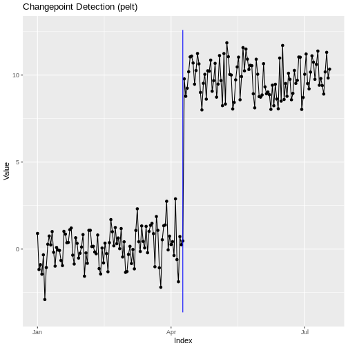

Bayesian engines return posterior probabilities instead: `bcp_wrapper()`
(posterior probability of a change at every location), `beast_wrapper()`
(Bayesian model averaging), and `bocpd_wrapper()` (online run-length
posterior). Two dedicated displays accompany them — `ggcpt_posterior()`
and `ggcpt_runlength()`:

``` r
res_bcp <- bcp_wrapper(x, seed = 1)
tidy(res_bcp)
#> # A tibble: 1 × 3
#>      cp cp_value posterior_prob
#>   <int>    <dbl>          <dbl>
#> 1   100    0.467              1
ggcpt_posterior(res_bcp)
```

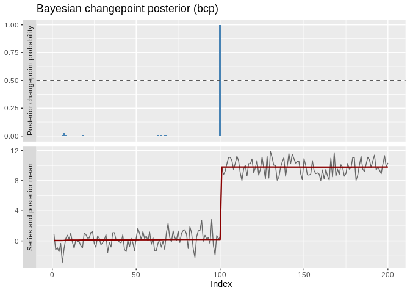

## The penalty path: CROPS

Instead of guessing one penalty, `cpt_crops()` computes **every**
optimal segmentation over a penalty range (Haynes, Eckley and Fearnhead,
2017) and plots the elbow diagnostic, the penalty path, or the candidate
segmentations themselves:

``` r
path <- cpt_crops(c(rnorm(100), rnorm(100, 3), rnorm(100, -1)))
path
#> ggcpt_path (CROPS penalty path)
#>   Change in:       mean 
#>   Penalty range:  [5.704, 57.04]
#>   Series length:   300 
#>   Distinct segmentations: 2 
#> 
#> # A tibble: 2 × 3
#>   penalty n_cpts  cost
#>     <dbl>  <int> <dbl>
#> 1    7.68      2  274.
#> 2    5.70      4  259.
autoplot(path)                          # cost elbow
```

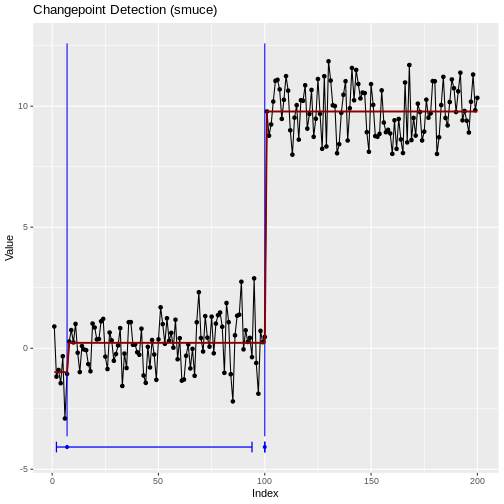

``` r
autoplot(path, type = "segmentations")  # see the actual candidate models
```

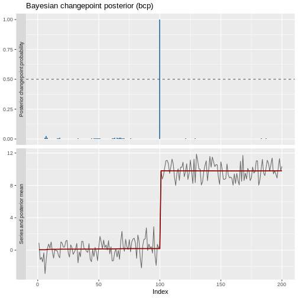

## Compare methods

``` r
ggcpt_compare(x, methods = c("pelt", "binseg", "fpop", "wbs"))
```

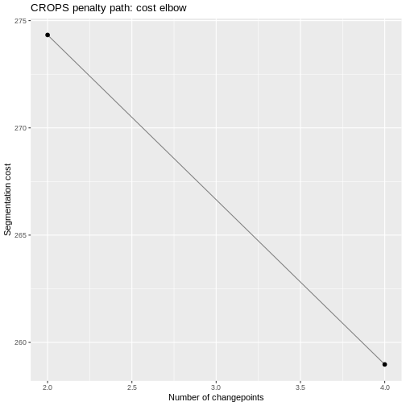

For a numeric summary, use `ggcpt_compare_table()`:

``` r
ggcpt_compare_table(x, methods = c("pelt", "binseg", "fpop", "wbs"))
#> # A tibble: 4 × 3
#>   method    cp cp_value
#>   <chr>  <int>    <dbl>
#> 1 pelt     100    0.467
#> 2 binseg   100    0.467
#> 3 fpop     100    0.467
#> 4 wbs      100    0.467
```

## Batch detection and stability diagnostics

`cpt_batch()` runs one detector over many series (a matrix, data frame,
or list) and returns a tidy tibble of results — honouring
`future::plan()` for parallel execution. `cpt_stability()`
bootstrap-resamples within fitted segments and reports how often each
location is re-detected, a cheap confidence signal for engines with no
native intervals:

``` r
X <- cbind(shifted = x, noise = rnorm(200))
batch <- cpt_batch(X, method = "pelt")
batch
#> ggcpt_batch (2 series, method: pelt)
#> 
#> # A tibble: 2 × 2
#>   series  n_changepoints
#>   <chr>            <int>
#> 1 shifted              1
#> 2 noise                0
autoplot(batch)
```

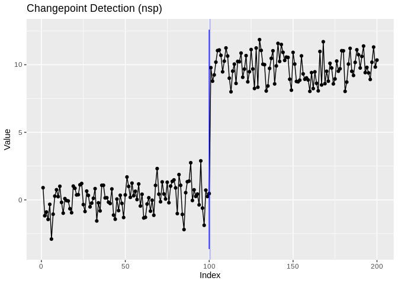

``` r
st <- cpt_stability(x, method = "pelt", B = 50, seed = 1)
st
#> ggcpt_stability (50 bootstrap replicates, method: pelt)
#> 
#> Original changepoints and their re-detection frequency:
#> # A tibble: 1 × 2
#>      cp stability
#>   <int>     <dbl>
#> 1   100         1
autoplot(st)
```

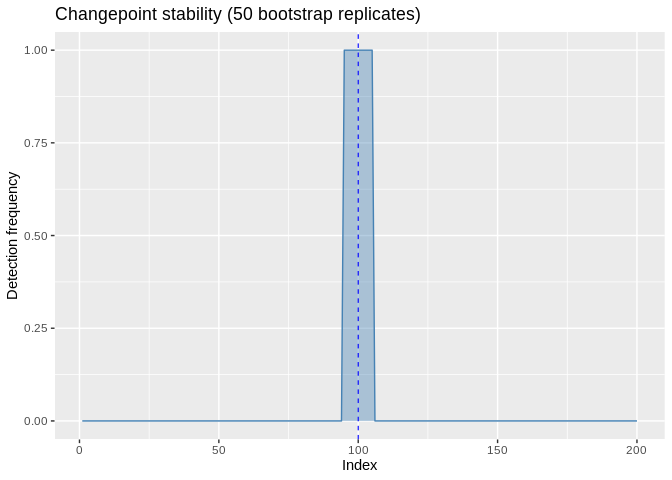

## Multivariate and high-dimensional detection

The multivariate engines accept a matrix (rows are time points) directly
through `cpt_detect()` and render as faceted small-multiples:

``` r
set.seed(1)
Xhd <- cbind(a = c(rnorm(80), rnorm(80, 3)),
             b = c(rnorm(80), rnorm(80, -2)),
             c = rnorm(160))
res_hd <- inspect_wrapper(Xhd)
tidy(res_hd)
#> # A tibble: 1 × 3
#>      cp cp_value strength
#>   <int>    <dbl>    <dbl>
#> 1    80   -0.590     21.9
autoplot(res_hd)
```

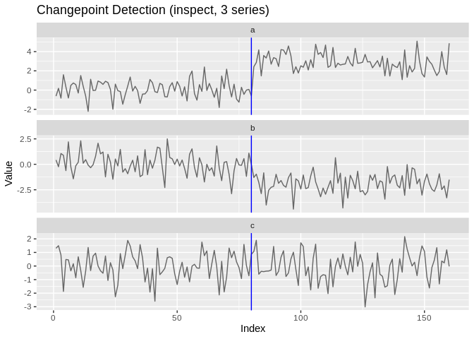

## Evaluation

When ground truth changepoints are known, compute accuracy metrics
(precision/recall/F1 under one-to-one matching, the covering metric,
Hausdorff distance, adjusted Rand index):

``` r
cpt_metrics(pred = c(100), truth = c(100), n = 200)
#> # A tibble: 1 × 12
#>       n n_pred n_truth precision recall    f1 covering hausdorff rand_index
#>   <int>  <int>   <int>     <dbl>  <dbl> <dbl>    <dbl>     <dbl>      <dbl>
#> 1   200      1       1         1      1     1        1         0          1
#> # ℹ 3 more variables: annotation_error <int>, mae_matched <dbl>,
#> #   rmse_matched <dbl>
```

When multiple annotation sets are available, use
`cpt_metrics_annotated()`, and visualise agreement with `ggcpt_eval()`:

``` r
cpt_metrics_annotated(c(100), list(c(100), c(101), c(99)), n = 200, margin = 5)
#> # A tibble: 1 × 7
#>       n n_annotators n_pred precision recall    f1 covering
#>   <dbl>        <int>  <int>     <dbl>  <dbl> <dbl>    <dbl>
#> 1   200            3      1         1      1     1    0.993
```

## Data simulation

``` r
dat <- cpt_simulate(200, changepoints = c(100), change_in = "mean",
                    params = c(0, 10), sd = 1)
attributes(dat)$true_changepoints
#> [1] 100
```

An alias `rcpt()` is provided for compatibility. Built-in test signals
include `signal_blocks()` (the Donoho–Johnstone blocks signal),
`signal_fms()`, `signal_mix()`, `signal_teeth()`, and `signal_stairs()`.

## Penalty configuration

Use `cpt_penalty()` to construct penalty values for use with detection
methods:

``` r
cpt_penalty("BIC", n = 200)
#> [1] 5.298317
cpt_penalty("AIC", n = 200)
#> [1] 2
cpt_penalty("Manual", value = 10)
#> [1] 10
```

## Direct engine wrappers

For fine-grained control, every engine has its own wrapper returning a
`ggcpt` object directly. The classic search/pruning engines:

``` r
fpop_wrapper(x, penalty = 2 * log(200))
#> ggcpt (changepoint detection result)
#>   Method:          fpop 
#>   Change in:       mean 
#>   Changepoints found: 1 
#>   CP convention:   left 
#>   Penalty:         Manual = 10.5966347330961 
#>   Series length:   200 
#> 
#> Changepoints:
#> # A tibble: 1 × 2
#>      cp cp_value
#>   <int>    <dbl>
#> 1   100    0.467
wbs_wrapper(x, n_intervals = 2000)
#> ggcpt (changepoint detection result)
#>   Method:          wbs 
#>   Change in:       mean 
#>   Changepoints found: 1 
#>   CP convention:   left 
#>   Penalty:         sSIC = NA 
#>   Series length:   200 
#> 
#> Changepoints:
#> # A tibble: 1 × 2
#>      cp cp_value
#>   <int>    <dbl>
#> 1   100    0.467
wbs2_wrapper(x)
#> ggcpt (changepoint detection result)
#>   Method:          wbs2 
#>   Change in:       mean 
#>   Changepoints found: 1 
#>   CP convention:   left 
#>   Penalty:         SDLL = NA 
#>   Series length:   200 
#> 
#> Changepoints:
#> # A tibble: 1 × 2
#>      cp cp_value
#>   <int>    <dbl>
#> 1   100    0.467
not_wrapper(x, contrast = "pcwsConstMean")
#> ggcpt (changepoint detection result)
#>   Method:          not 
#>   Change in:       mean 
#>   Changepoints found: 1 
#>   CP convention:   left 
#>   Penalty:         sSIC = NA 
#>   Series length:   200 
#> 
#> Changepoints:
#> # A tibble: 1 × 2
#>      cp cp_value
#>   <int>    <dbl>
#> 1   100    0.467
mosum_wrapper(x)
#> ggcpt (changepoint detection result)
#>   Method:          mosum 
#>   Change in:       mean 
#>   Changepoints found: 1 
#>   CP convention:   left 
#>   Penalty:         threshold = 3.63416800924526 
#>   Series length:   200 
#> 
#> Changepoints:
#> # A tibble: 1 × 2
#>      cp cp_value
#>   <int>    <dbl>
#> 1   100    0.467
idetect_wrapper(x)
#> ggcpt (changepoint detection result)
#>   Method:          idetect 
#>   Change in:       mean 
#>   Changepoints found: 1 
#>   CP convention:   left 
#>   Penalty:         threshold = NA 
#>   Series length:   200 
#> 
#> Changepoints:
#> # A tibble: 1 × 2
#>      cp cp_value
#>   <int>    <dbl>
#> 1   100    0.467
tguh_wrapper(x)
#> ggcpt (changepoint detection result)
#>   Method:          tguh 
#>   Change in:       mean 
#>   Changepoints found: 1 
#>   CP convention:   left 
#>   Penalty:         sSIC = NA 
#>   Series length:   200 
#> 
#> Changepoints:
#> # A tibble: 1 × 2
#>      cp cp_value
#>   <int>    <dbl>
#> 1   100    0.467
```

And the 0.4.0 wave (each behind its `Suggests` engine):
`smuce_wrapper()`, `cpop_wrapper()`, `bcp_wrapper()`, `bocpd_wrapper()`,
`beast_wrapper()`, `cpm_wrapper()`, `kcp_wrapper()`, `npmojo_wrapper()`,
`decafs_wrapper()`, `sn_wrapper()`, `inspect_wrapper()`,
`ocd_wrapper()`, `geomcp_wrapper()`, `strucchange_wrapper()`,
`segmented_wrapper()`, `envcpt_wrapper()`, and `fastcpd_wrapper()`.

``` r
# change-in-slope: exact penalised broken-line estimation
y_slope <- cumsum(c(rep(0.4, 100), rep(-0.3, 100))) + rnorm(200)
res_slope <- cpop_wrapper(y_slope)
autoplot(res_slope, show_fit = TRUE)
```

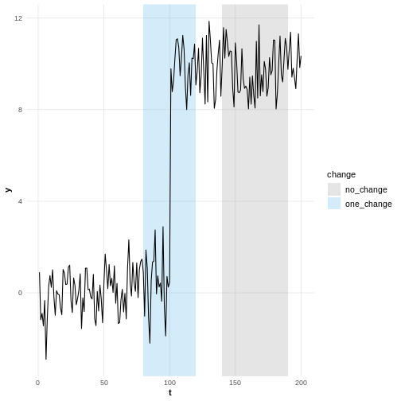

## Custom geoms, stats, and theming

The package provides composable ggplot2 layers for changepoint
visualisation:

``` r
library(ggplot2)

# Use geom_changepoint as a standalone layer
cp_tbl <- tidy(cpt_detect(x, method = "pelt", change_in = "mean"))
ggplot(data.frame(index = seq_along(x), value = x), aes(index, value)) +
  geom_line() +
  geom_changepoint(data = cp_tbl, aes(xintercept = cp), color = "red") +
  theme_ggcpt()

# Use stat_changepoint to compute and draw changepoints in one step
ggplot(data.frame(index = seq_along(x), value = x), aes(index, value)) +
  geom_line() +
  stat_changepoint(method = "pelt", color = "red")

# Shade alternating segments between changepoints
ggplot(data.frame(index = seq_along(x), value = x), aes(index, value)) +
  geom_line() +
  annotate_segments(cp = cp_tbl$cp, n = length(x))

# Highlight segments with geom_cpt_segment
ggplot(data.frame(index = seq_along(x), value = x), aes(index, value)) +
  geom_line() +
  geom_cpt_segment(data = cp_tbl, aes(xintercept = cp), color = "blue")

# Draw confidence intervals with geom_cpt_ci (when the engine provides them)
cp_ci <- tidy(smuce_wrapper(x))
ggplot(data.frame(index = seq_along(x), value = x), aes(index, value)) +
  geom_line() +
  geom_cpt_ci(data = cp_ci,
              aes(x = cp, xmin = ci_lower, xmax = ci_upper, y = min(x) - 1))
```

## Interactive exploration and citations

Any result (or ggplot built from one) renders as an interactive widget
with `ggcpt_interactive()` (requires `plotly`). And `cpt_cite()` returns
the methodological reference behind a result, so analyses can cite the
right paper without leaving R:

``` r
cpt_cite("pelt")
#> [pelt] Killick, R., Fearnhead, P. and Eckley, I. A. (2012). Optimal detection of changepoints with a linear computational cost. Journal of the American Statistical Association, 107(500), 1590-1598.
```

``` r
ggcpt_interactive(res)   # hover for values; requires plotly
```

## Class constructors

Advanced users can construct `ggcpt` objects directly or test for the
class:

``` r
new_ggcpt(
  changepoints = tibble::tibble(cp = 100L, cp_value = 5.0),
  data = tibble::tibble(index = 1:200, value = rnorm(200)),
  method = "manual"
)
is_ggcpt(x)
```

## Original ecp wrapper

The `ecp_wrapper()` and its plotting function `ggecpplot()` provide
direct access to the ecp engine (including genuine multivariate input):

``` r
ecp_wrapper(x, algorithm = "divisive")
ggecpplot(x, algorithm = "divisive")
```

## Original wrappers (0.1.0 API)

The original `cpt_wrapper()`, `ecp_wrapper()`, `ggcptplot()`, and
`ggecpplot()` continue to work unchanged for backward compatibility.

``` r
cpt_wrapper(x)
#> # A tibble: 1 × 2
#>      cp cp_value
#>   <int>    <dbl>
#> 1   100    0.467
ggcptplot(x)
```

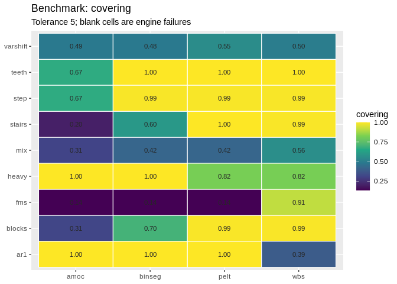

## Additional S3 methods

The `ggcpt` class also provides:

``` r
res <- cpt_detect(x, method = "pelt", change_in = "mean")
summary(res)          # human-readable digest
#> ggcpt Summary
#>   Method:                   pelt 
#>   Change in:                mean 
#>   Changepoints found:       1 
#>   CP convention:            left 
#>   Series length:            200 
#>   Penalty:                  MBIC = NA 
#>   Runtime (seconds):        0.003 
#> 
#> Segments:
#> # A tibble: 2 × 5
#>   seg_id start   end     n param_estimate
#>    <int> <dbl> <int> <dbl>          <dbl>
#> 1      1     1   100   100          0.139
#> 2      2   101   200   100          9.80 
#> 
#> Changepoints:
#> # A tibble: 1 × 2
#>      cp cp_value
#>   <int>    <dbl>
#> 1   100    0.467
as_tibble(res)        # tibble of changepoints
#> # A tibble: 1 × 2
#>      cp cp_value
#>   <int>    <dbl>
#> 1   100    0.467
as.data.frame(res)    # data frame of changepoints
#>    cp cp_value
#> 1 100 0.467023
format(res)           # one-line summary string
#> [1] "ggcpt [pelt] 1 changepoint(s) on 200 observations"
plot(res)             # base-graphics fallback (delegates to autoplot)
```

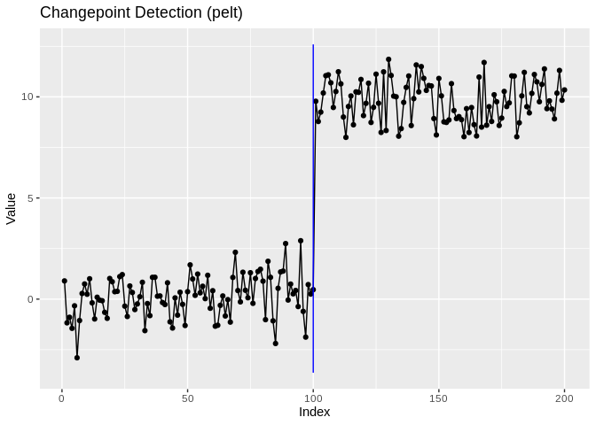

## Learn more

See the vignettes for a comprehensive walkthrough:

- `vignette("ggchangepoint", package = "ggchangepoint")` — feature tour
- `vignette("introduction", package = "ggchangepoint")` — the framework,
  in research-paper form
- `vignette("comparison", package = "ggchangepoint")` — method
  comparison and evaluation
