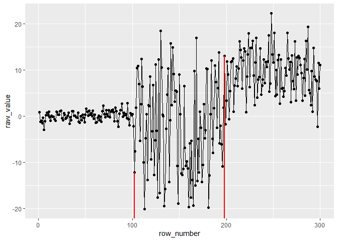

<!-- README.md is generated from README.Rmd. Please edit that file -->

# ggchangepoint

<!-- badges: start -->

[](https://github.com/PursuitOfDataScience/ggchangepoint/actions)
[](https://CRAN.R-project.org/package=ggchangepoint)
[](https://lifecycle.r-lib.org/articles/stages.html#experimental)
<!-- badges: end -->

The goal of ggchangepoint is to offer the tidyverse style on the
changepoint analysis. R already provides a number of changepoint
packages, such as ‘changepoint’, ‘changepoint.np’, and ‘ecp’ etc. The
plots generated by these packages do not have the ggplot2 style, making
the changepoint analysis not coherent to the tidyverse ecosystem.
ggchangepoint is the outset to change it.

## Installation

Please install the released version of `ggchangepoint` from CRAN with:

``` r
install.packages("ggchangepoint")
```

Alternatively, you can install the latest development version from
Github with:

``` r
# install.packages("devtools")
devtools::install_github("PursuitOfDataScience/ggchangepoint")
```

## Usage

Let’s briefly see how to use the package on a randomly generated
dataset.

``` r
library(ggchangepoint)
library(ggplot2)
```

``` r
set.seed(2022)

data <- data.frame(x = c(rnorm(100, 0, 1), 
                         rnorm(100, 0, 10),
                         rnorm(100, 10, 5)))
```

### `cpt_wrapper()`

The function `cpt_wrapper()` is a function that extracts the
changepoints detected by `cpt.mean()`, `cpt.var()`, `cpt.meanvar()` from
the changepoint package and `cpt.np()` from the changepoint.np package.
It returns to the user a tibble with the changepoint positions and the
changepoint raw values provided by the user.

``` r
cpt_wrapper(data$x)
#> # A tibble: 2 x 2
#>      cp cp_value
#>   <int>    <dbl>
#> 1   100    0.467
#> 2   199   -1.68
```

By default, `cpt_wrapper()` takes `cpt.meanvar()` with `PELT` as the
changepoint method, but users can change the changepoint function and
method. For details, please type `?ecp_wrapper` at the console.

### `ggcptplot()`

Now we can visualize the raw data with the changepoints detected
included.

``` r
ggcptplot(data$x)
```


Users can change the changepoint line color, size, transparency, and
type. For details, type `?ggcptplot` at the console.

``` r
ggcptplot(data$x, cptline_color = "red", cptline_size = 1)
```


Let’s tidy the plot above:

``` r
ggcptplot(data$x, cptline_color = "red", cptline_size = 1) +
  labs(x = "row #",
       y = "data",
       title = "Changepoints Detected by cpt.meanvar()")
```


### `ecp_wrapper()`

`ecp_wrapper()` is analogous to `cpt_wrapper()`, but internally it uses
the ecp package, and the arguments the function are different as well.

``` r
ecp_wrapper(data$x, min_size = 10)
#> # A tibble: 3 x 2
#>      cp cp_value
#>   <dbl>    <dbl>
#> 1   102    -12.2
#> 2   152    -12.4
#> 3   198     13.1
```

### `ggecpplot()`

We can also visualize the changepoints by using `ggecpplot()`:

``` r
ggecpplot(data$x, min_size = 10, cptline_size = 1, cptline_color = "red")
```



This is the first version of the package offering the changepoint
analysis the tidyverse style, and in the future more functionality and
changepoint packages will be included. For the comprehensive
introduction of the package, please refer to the vignette.
