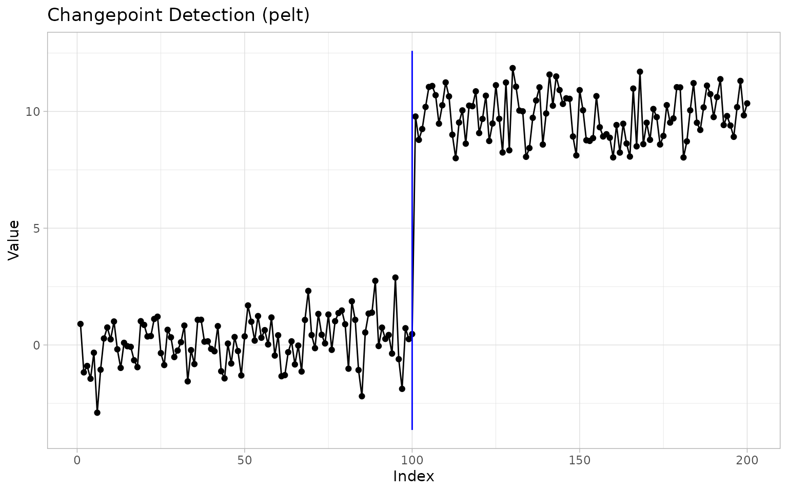
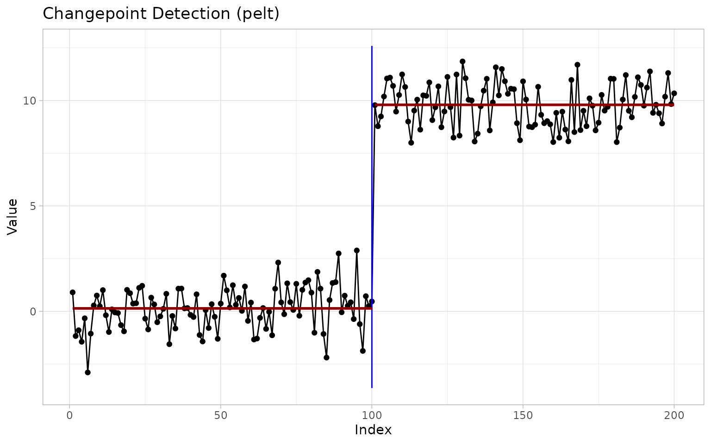
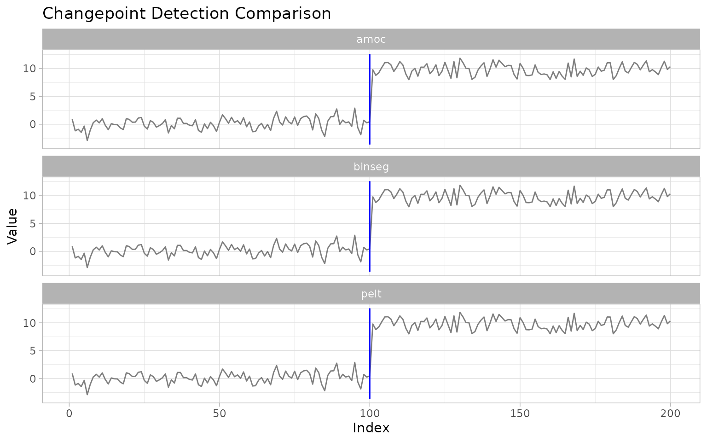
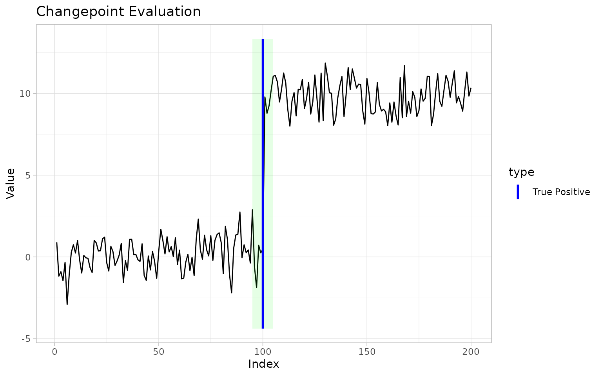

# ggchangepoint feature tour

## Introduction

This vignette gives a quick tour of every major feature in
ggchangepoint. See
[`vignette("introduction")`](https://pursuitofdatascience.github.io/ggchangepoint/articles/introduction.md)
for a detailed walkthrough and
[`vignette("comparison")`](https://pursuitofdatascience.github.io/ggchangepoint/articles/comparison.md)
for method comparison.

``` r

set.seed(2022)
x <- c(rnorm(100, 0, 1), rnorm(100, 10, 1))
```

## Core detection

The unified entry point is
[`cpt_detect()`](https://pursuitofdatascience.github.io/ggchangepoint/reference/cpt_detect.md):

``` r

res <- cpt_detect(x, method = "pelt", change_in = "mean")
res
#> ggcpt (changepoint detection result)
#>   Method:          pelt 
#>   Change in:       mean 
#>   Changepoints found: 1 
#>   CP convention:   left 
#>   Penalty:         MBIC = NA 
#>   Series length:   200 
#> 
#> Changepoints:
#> # A tibble: 1 × 2
#>      cp cp_value
#>   <int>    <dbl>
#> 1   100    0.467
```

## Broom methods

Every result object supports
[`tidy()`](https://generics.r-lib.org/reference/tidy.html),
[`glance()`](https://generics.r-lib.org/reference/glance.html), and
[`augment()`](https://generics.r-lib.org/reference/augment.html):

``` r

tidy(res)
#> # A tibble: 1 × 2
#>      cp cp_value
#>   <int>    <dbl>
#> 1   100    0.467
glance(res)
#> # A tibble: 1 × 9
#>       n n_changepoints method change_in penalty_type penalty_value cp_convention
#>   <int>          <int> <chr>  <chr>     <chr>                <dbl> <chr>        
#> 1   200              1 pelt   mean      MBIC                    NA left         
#> # ℹ 2 more variables: total_cost <dbl>, runtime <dbl>
augment(res)
#> # A tibble: 200 × 6
#>    index  value seg_id .fitted .resid is_changepoint
#>    <int>  <dbl>  <int>   <dbl>  <dbl> <lgl>         
#>  1     1  0.900      1   0.139  0.761 FALSE         
#>  2     2 -1.17       1   0.139 -1.31  FALSE         
#>  3     3 -0.897      1   0.139 -1.04  FALSE         
#>  4     4 -1.44       1   0.139 -1.58  FALSE         
#>  5     5 -0.331      1   0.139 -0.470 FALSE         
#>  6     6 -2.90       1   0.139 -3.04  FALSE         
#>  7     7 -1.06       1   0.139 -1.20  FALSE         
#>  8     8  0.278      1   0.139  0.139 FALSE         
#>  9     9  0.749      1   0.139  0.611 FALSE         
#> 10    10  0.242      1   0.139  0.103 FALSE         
#> # ℹ 190 more rows
```

## Additional S3 methods

The `ggcpt` class also provides
[`summary()`](https://rdrr.io/r/base/summary.html),
[`as_tibble()`](https://tibble.tidyverse.org/reference/as_tibble.html),
[`as.data.frame()`](https://rdrr.io/r/base/as.data.frame.html),
[`format()`](https://rdrr.io/r/base/format.html), and
[`plot()`](https://rdrr.io/r/graphics/plot.default.html):

``` r

summary(res)
#> ggcpt Summary
#>   Method:                   pelt 
#>   Change in:                mean 
#>   Changepoints found:       1 
#>   CP convention:            left 
#>   Series length:            200 
#>   Penalty:                  MBIC = NA 
#>   Runtime (seconds):        0.016 
#> 
#> Segments:
#> # A tibble: 2 × 5
#>   seg_id start   end     n param_estimate
#>    <int> <dbl> <int> <dbl>          <dbl>
#> 1      1     1   100   100          0.139
#> 2      2   101   200   100          9.80 
#> 
#> Changepoints:
#> # A tibble: 1 × 2
#>      cp cp_value
#>   <int>    <dbl>
#> 1   100    0.467
as_tibble(res)
#> # A tibble: 1 × 2
#>      cp cp_value
#>   <int>    <dbl>
#> 1   100    0.467
plot(res)
```



## Visualisation

[`autoplot()`](https://ggplot2.tidyverse.org/reference/autoplot.html)
renders any result with `ggplot2`:

``` r

autoplot(res, show_segments = TRUE)
```



## Custom geoms and stats

The package ships four composable layers:

``` r

cp_tbl <- tidy(res)

# Standalone geom
ggplot(data.frame(index = seq_along(x), value = x), aes(index, value)) +
  geom_line() +
  geom_changepoint(data = cp_tbl, aes(xintercept = cp), color = "red")

# Compute-and-draw stat
ggplot(data.frame(index = seq_along(x), value = x), aes(index, value)) +
  geom_line() +
  stat_changepoint(method = "pelt", color = "red")

# Segments and CIs
ggplot(data.frame(index = seq_along(x), value = x), aes(index, value)) +
  geom_line() +
  geom_cpt_segment(data = cp_tbl, aes(xintercept = cp))

# Theming and segment shading
ggplot(data.frame(index = seq_along(x), value = x), aes(index, value)) +
  geom_line() +
  geom_changepoint(data = cp_tbl, aes(xintercept = cp)) +
  theme_ggcpt() +
  annotate_segments(cp = cp_tbl$cp, n = length(x))
```

## Penalty configuration

Construct standard penalty values:

``` r

cpt_penalty("BIC", n = 200)
#> [1] 5.298317
cpt_penalty("MBIC", n = 200, k = 1)
#> [1] 10.59663
cpt_penalty("Manual", value = 10)
#> [1] 10
```

## Method introspection

[`cpt_methods()`](https://pursuitofdatascience.github.io/ggchangepoint/reference/cpt_methods.md)
returns the full table of available and planned methods:

``` r

cpt_methods()
#> # A tibble: 26 × 6
#>    method   change_in          engine         status    target_release installed
#>    <chr>    <chr>              <chr>          <chr>     <chr>          <lgl>    
#>  1 pelt     mean, var, meanvar changepoint    available NA             TRUE     
#>  2 binseg   mean, var, meanvar changepoint    available NA             TRUE     
#>  3 segneigh mean, var, meanvar changepoint    available NA             TRUE     
#>  4 amoc     mean, var, meanvar changepoint    available NA             TRUE     
#>  5 np       distribution       changepoint.np available NA             TRUE     
#>  6 ecp      distribution       ecp            available NA             TRUE     
#>  7 fpop     mean               fpop           available NA             TRUE     
#>  8 wbs      mean               wbs            available NA             TRUE     
#>  9 wbs2     mean               breakfast      available NA             TRUE     
#> 10 not      mean, var, slope   not            available NA             TRUE     
#> # ℹ 16 more rows
```

## Per-engine wrappers

For fine-grained control, each engine has its own wrapper:

``` r

fpop_wrapper(x, penalty = 2 * log(200))
wbs_wrapper(x, n_intervals = 2000)
not_wrapper(x, contrast = "pcwsConstMean")
mosum_wrapper(x)
idetect_wrapper(x)
tguh_wrapper(x)
```

## Method comparison

Compare multiple methods in a single visualisation:

``` r

suppressWarnings(
  ggcpt_compare(x, methods = c("pelt", "binseg", "amoc"))
)
```



``` r

ggcpt_compare_table(x, methods = c("pelt", "binseg", "amoc"))
#> # A tibble: 3 × 3
#>   method    cp cp_value
#>   <chr>  <dbl>    <dbl>
#> 1 pelt     100    0.467
#> 2 binseg   100    0.467
#> 3 amoc     100    0.467
```

## Evaluation

When ground truth is known, compute accuracy metrics:

``` r

cpt_metrics(pred = c(100), truth = c(100), n = 200, margin = 5)
#> # A tibble: 1 × 12
#>       n n_pred n_truth precision recall    f1 covering hausdorff rand_index
#>   <int>  <int>   <int>     <dbl>  <dbl> <dbl>    <dbl>     <dbl>      <dbl>
#> 1   200      1       1         1      1     1        1         0          1
#> # ℹ 3 more variables: annotation_error <int>, mae_matched <dbl>,
#> #   rmse_matched <dbl>
cpt_metrics_annotated(c(100), list(c(100), c(101), c(99)), n = 200, margin = 5)
#> # A tibble: 1 × 7
#>       n n_annotators n_pred precision recall    f1 covering
#>   <dbl>        <int>  <int>     <dbl>  <dbl> <dbl>    <dbl>
#> 1   200            3      1         1      1     1    0.993
ggcpt_eval(pred = c(100), truth = c(100), data_vec = x)
```



## Data simulation

Generate synthetic data with known changepoints:

``` r

dat <- cpt_simulate(200, changepoints = c(100), change_in = "mean",
                    params = c(0, 10), sd = 1)
attributes(dat)$true_changepoints
#> [1] 100
rcpt(200, changepoints = c(100), change_in = "mean", params = c(0, 10))
#> # A tibble: 200 × 3
#>    index  value seg_id
#>    <int>  <dbl>  <int>
#>  1     1  0.825      1
#>  2     2 -2.15       1
#>  3     3  0.276      1
#>  4     4  1.07       1
#>  5     5  1.72       1
#>  6     6  0.300      1
#>  7     7  1.10       1
#>  8     8  0.515      1
#>  9     9  0.489      1
#> 10    10 -1.01       1
#> # ℹ 190 more rows
```

Build-in test signals:

``` r

signal_blocks(200)
#> # A tibble: 200 × 2
#>    index   value
#>    <int>   <dbl>
#>  1     1  0.376 
#>  2     2 -0.148 
#>  3     3 -0.0518
#>  4     4 -0.541 
#>  5     5 -0.940 
#>  6     6 -0.446 
#>  7     7 -0.803 
#>  8     8 -0.210 
#>  9     9 -0.0291
#> 10    10 -0.531 
#> # ℹ 190 more rows
signal_fms(200)
#> # A tibble: 200 × 2
#>    index   value
#>    <int>   <dbl>
#>  1     1  0.0892
#>  2     2 -0.411 
#>  3     3 -0.593 
#>  4     4 -0.0156
#>  5     5  0.0237
#>  6     6 -0.0653
#>  7     7 -0.203 
#>  8     8 -0.933 
#>  9     9  0.0847
#> 10    10  0.517 
#> # ℹ 190 more rows
signal_mix(200)
#> # A tibble: 200 × 2
#>    index   value
#>    <int>   <dbl>
#>  1     1 -0.542 
#>  2     2  0.430 
#>  3     3  0.196 
#>  4     4  0.0334
#>  5     5  0.260 
#>  6     6  0.505 
#>  7     7  1.20  
#>  8     8 -1.38  
#>  9     9 -0.812 
#> 10    10  1.07  
#> # ℹ 190 more rows
signal_teeth(200)
#> # A tibble: 200 × 2
#>    index   value
#>    <int>   <dbl>
#>  1     1  0.145 
#>  2     2  0.643 
#>  3     3 -0.129 
#>  4     4 -0.0788
#>  5     5 -0.263 
#>  6     6 -0.815 
#>  7     7  0.596 
#>  8     8 -0.734 
#>  9     9  0.0484
#> 10    10  0.436 
#> # ℹ 190 more rows
signal_stairs(200)
#> # A tibble: 200 × 2
#>    index   value
#>    <int>   <dbl>
#>  1     1  0.543 
#>  2     2  0.773 
#>  3     3  0.297 
#>  4     4 -0.152 
#>  5     5 -0.0409
#>  6     6  0.0735
#>  7     7 -0.0611
#>  8     8  0.524 
#>  9     9 -0.365 
#> 10    10  0.471 
#> # ℹ 190 more rows
```

## Class constructors

Advanced users can construct `ggcpt` objects directly:

``` r

new_ggcpt(
  changepoints = tibble::tibble(cp = 100L, cp_value = 5.0),
  data = tibble::tibble(index = 1:200, value = rnorm(200)),
  method = "manual"
)
is_ggcpt(res)
```

## Original 0.1.0 API

The original wrappers remain available:

``` r

cpt_wrapper(x, change_in = "mean")
ecp_wrapper(x, algorithm = "divisive")
ggcptplot(x)
ggecpplot(x, algorithm = "divisive")
```

## Parallel execution

[`ggcpt_compare()`](https://pursuitofdatascience.github.io/ggchangepoint/reference/ggcpt_compare.md)
honours
[`future::plan()`](https://future.futureverse.org/reference/plan.html)
for parallel execution:

``` r

future::plan("multisession")
ggcpt_compare(x, methods = c("pelt", "binseg", "fpop", "wbs"))
future::plan("sequential")
```
