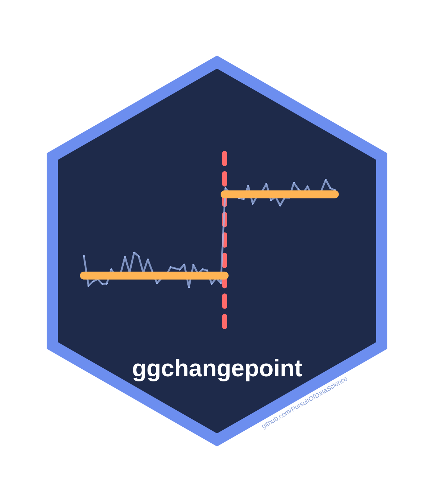

# ggchangepoint



**Find where a time series changed with any of 50 methods, and get the
same tidy, plottable answer from every one.**

## 🔍 One series, one call, one picture

``` r

library(ggchangepoint)
fit <- cpt_detect(Nile, method = "smuce")
fit$changepoints
#> # A tibble: 1 × 5
#>      cp cp_index cp_value ci_lower ci_upper
#>   <int>    <dbl>    <dbl>    <int>    <int>
#> 1    28     1898     1100       26       31
autoplot(fit, show_ci = TRUE)
```


Five detectors built on different ideas agree:

``` r

ggcpt_compare_table(Nile, methods = c("smuce", "not", "wbs", "mosum",
                                      "strucchange"))
#> # A tibble: 5 × 3
#>   method         cp cp_value
#>   <chr>       <int>    <dbl>
#> 1 smuce          28     1100
#> 2 not            28     1100
#> 3 wbs            28     1100
#> 4 mosum          28     1100
#> 5 strucchange    28     1100
```

## 🧰 Then ask the next question

| You want to know | Call |
|:---|:---|
| How big was the change? | `cpt_effect(fit)` |
| Did anything change in a year I already had in mind? | `cpt_test_at(Nile, when = 1899)` |
| Should I believe this count? | `cpt_assumptions(fit)` |
| Which method suits my data? | `cpt_recommend(noise = "autocorrelated")` |
| Counts, 0/1 outcomes, waiting times? | `cpt_detect(x, family = "poisson")` |
| When did a regression’s slope break? | `cpt_detect(y ~ x, data = d, method = "strucchange")` |
| What can each of the 50 methods do? | [`cpt_methods()`](https://pursuitofdatascience.github.io/ggchangepoint/reference/cpt_methods.md) |

## 🚀 Setup

1.  `install.packages("ggchangepoint")`
2.  `ggchangepoint::cpt_install_engines(c("core", "regression"))` adds
    the engines this page uses (`"all"` for every one; three ship with
    the package).
3.  `cpt_detect(your_series)`, then
    [`autoplot()`](https://ggplot2.tidyverse.org/reference/autoplot.html)
    the result.

## ⚠️ What will bite you

| Trap | Fix |
|:---|:---|
| `pelt`, `binseg` and `fpop` assume unit noise: on raw Nile flows `pelt` reports 42 changepoints | The package warns. Standardise, or use `change_in = "meanvar"` |
| Autocorrelated noise makes spurious changepoints in every engine | `cpt_assumptions(fit)` checks; `cpt_robustness(fit)` re-runs under another noise model |
| A p-value at a location the data chose is too small | [`cpt_test_at()`](https://pursuitofdatascience.github.io/ggchangepoint/reference/cpt_test_at.md) at a date fixed in advance is exact |
| Missing values are refused | `na_action = "omit"` keeps the original positions |

## 📚 Learn more

[Reference](https://pursuitofdatascience.github.io/ggchangepoint/reference/)
· [Choosing a
method](https://pursuitofdatascience.github.io/ggchangepoint/articles/choosing.html)
· [Ten ways to get a changepoint
wrong](https://pursuitofdatascience.github.io/ggchangepoint/articles/pitfalls.html)
·
[Introduction](https://pursuitofdatascience.github.io/ggchangepoint/articles/introduction.html)
